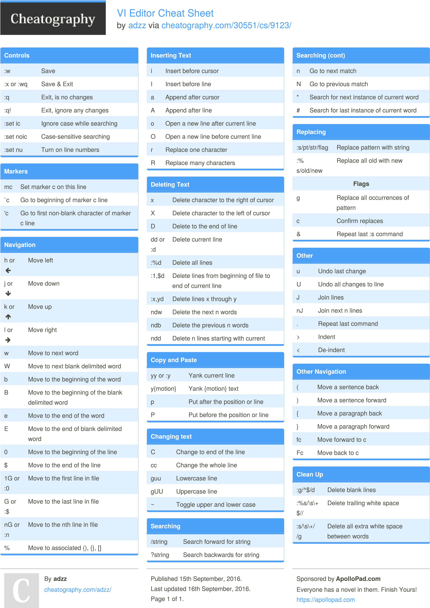
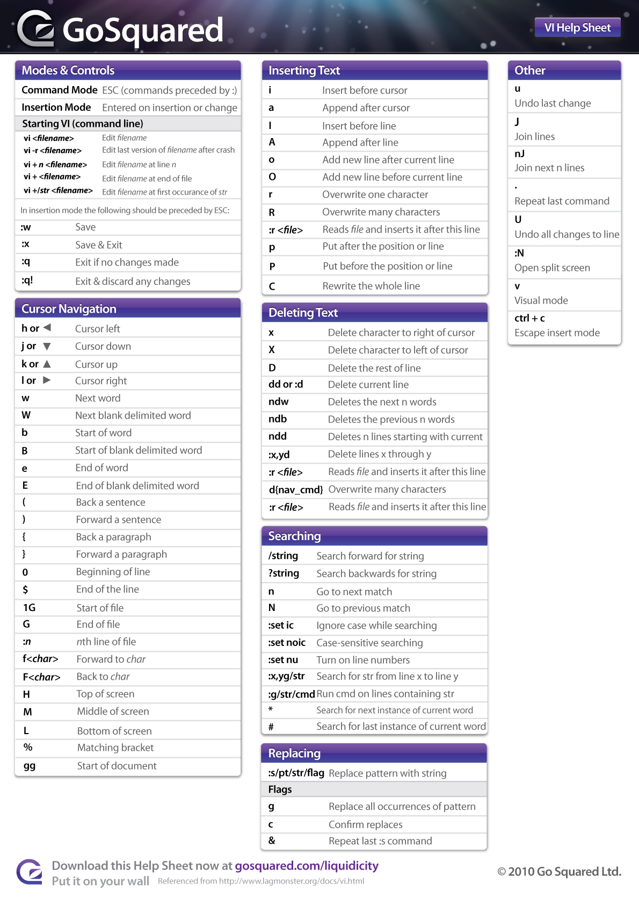
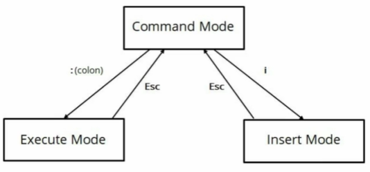
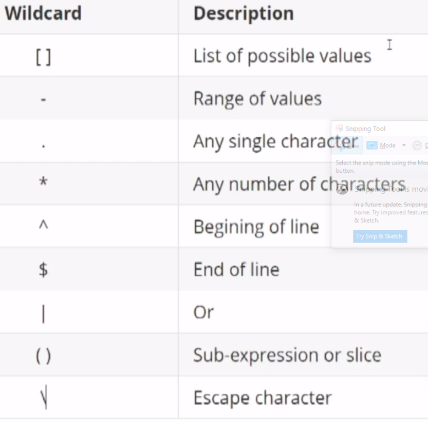

# Linux

## Hvordan finder jeg hjælp?

### man
`man <kommando>`
- **man**
    - `man man` viser hvordan man bruger kommandoen
	- Kan bruges med en værdi som refererer bestemt sektion i manualen:
		1. User Commands
		2. System Calls
      	3. C Library Functions
		4. Devices and Special Files
		5. File Formats and Conventions
		6. Games et. Al.
		7. Miscellanea
		8. System Administration tools and Daemons
     	-  `man 7 regex` kigger kun i sektionen "miscellanea" for regex
	
---
## Installation og vedligehold pakker på Linux

Husk generelt at opdatere inden installation.

### tasksel

Denne pakke giver mulighed for at installere flere pakker samlet og holder styr på afhængigheder.

### dpkg - GAMMEL - bruges ikke mere

### apt-get - benyttes i Ubuntu

- `apt-get install tasksel`
- `apt-get update`
- `apt-get install <pakke>`
- `apt-get remove <pakke>`
- `apt-get upgrade -y`
- Fjern pakker igen ....
	- `apt-get remove vsftpd`
	- `apt-get purge vsftpd` (sletter også selve konfiguration og øvrige filer til pakken)
	- `apt-get autoremove` - fjerner dependencies 


### apt

Denne kommando afløser apt-get og apt-cache. apt samler de to nævnte til en og samme kommando.

- **/etc/apt/sorces.list** - Repositories - her kan tilføjes yderligere REPOs
- Hvis tilføjet/ændret REPO skal cachen opdateres
- `apt update` - opdaterer REPO cachen og INTET andet
- `apt list apache*` - fortæller om denne finde på dette REPO med wildcard
- `apt search apache` - søger igennem hele REPO metadata
- `apt instal apache2` 
- `apt upgrade` - denne vil opdatere alle software pakker hvis den finder nyere pakker på REPO's
	- Lister først hvilke pakker den vil opdatere inden du skal bekræfte
- `apt upgrade-dist` - denne bruges ved opdatering af selve linux distributionen og den skal klart planlægges :-)
- `apt remove apache2` - fjerner en pakke og dependencies

### yum - benyttet i alle redhat distribution CentOS, fedora

dnf erstatter måske yum (er allerede på fedora) - men brugen er helt den samme.
Tidligere RPM - men denne kommando kunne ikke opløse dependencies.

- **/etc/yum.repos.d**
- `yum update` - modsat apt så updaterer denne både cache og pakker og også kernel pakker etc.
- `yum upgrade` - opgraderer vistnok det der allerede er installeret
- `yum search gedit`
- `yum install gedit -y`
- `yum info gedit` - giver information om en given pakke
- `yum repolist all` - tjekker enabled/disabled reposotories
- `yum list *apache*`
- `yum list installed | grep httpd` - undersøg om httpd allerede er installeret
- `yum info httpd` - vis alt om det installerede httpd modul
- `yum remove httpd` Fjern pakker igen


### rpm - til at installere filer hentet fra internettet

- `rpm -q pakkenavn_uden_extension` - viser om pakken allerede er installeret.
- `rpm -iv filnavn.rpm` - installerer pakken
- `rpm -e pakkenavn` - fjerner pakken fra systemet igen


### Patchning af linux

`uname -sr` - viser den aktuelle version af kernel.

- **Ubuntu**
	- `uname -sr` - viser den aktuelle version af kernel
	- `apt-get update` - opdater den lokale software list og "notificerer" OS om opdateringer
	- `apt-get -dist-upgrade`
- **CentOS**
	- `yum check-update` - opdater den lokale software list og "notificerer" OS om opdateringer
	- `yum update` - opdaterer


---
## Kompiler selv pakker .....

- Installer gcc, make,gzip på systemet
- Unpak din sourcekode - "tar XVZf fileName.tar.gz"
- Hvis source har make files er det nemt
	- `make` - udføres denne listes hvilke "arkitektur" der kan compileres til
	- `make clean akitektur` - danner en "run" folder med det kompilerede og kan køres herfra
	- `make install aktitektur` - den compilerer og installerer efterfølgende


---
## Kernel .....

- `uname -a` - viser hvilken kernel version distributionen benytter
	- `-sr` - viser den aktuelle version af kernel
- Folder boot indeholder selve kernel-filen
- **/usr/lib/modules** - modulerne i denne folder samles med boot i RAM
- `lsmod` - viser hvilke moduler 
- `modinfo modulNavn` - viser mere info om de moduler der indlæses i kernel
- `insmod fileName` - installerer nye moduler eksempelvis en netværks driver
- `rmmod xxxx` - sletter modulet xxxx
- `modprobe` - udføres denne checkes hardware for om der findes nye drivere og indlæser hvis nødvendigt
- `sysctl -a`  - lister alle parametre kernel opstartes med
		

---
## Søgninger .....

- Binære filer
    - `which command` finder hvor på filsystemet hvilken fil den bruger (kan ligge flere steder).
    - `whereis ssh` - viser alle forekomster
- `type ls` - viser hvad kommandoen egentlig er

### locate

- `locate` er hurtigst, men kræver at der er opdateret !!
	- Opdateres dagligt
	- Manuelt opdateres den med **updatedb**


TODO: Hvad med locate - skal vist uddybes????


### find

Kigger altid på disken som den ser ud lige nu

- **find**
    - `Find -iname filename` - denne er case in-sensitive
	- Der  kan bruges vildcard *
	- `find -name test.TEST 2>/dev/null` dette trick fjerner de fejl der kan opstå med kommandoen når den eksempelvis besøger en folder du ikke har adgang til.
	- `find . -name kermit.txt` - her ledes i aktuel folder på sub-foldere
	- `find / -name kermit.txt` - denne vil generere en masse fejl og kan sorteres fra på følgende måde:
	- `find tafe04osbServer1-diagnostic* -size 0c -type f -exec rm {} \; > results.out` - find 0 bytes filer og slet dem


---
## Generelle kommandoer

### history

Viser alle kommandoer brugeren har udført siden start. 

`history`

### whoami - **who am i**?

Viser hvem du aktuelt er logget ind som

`whoami`

### who

Lister dem er aktuelt er logget ind i systemet.

`who`

### top

Svarer til windows taskmanager.

`top`

Der kan benyttes følgende short-cuts når kommandoen er startet :

- `h` - help
- `u` kun egne processer
- `k` - kill af med PID og denne slår processen ned.
- shift + m - sorterer efter memory forbrug
- shift+ p - sorterer efter CPU


`grep`

- kan benyttes sammen med Regex
- **i** - ignore case
- **grep -r Kermit /home/wmprpee** - søger rekursivt efter Kermit
- **grep -E "Halloween|Christmas"** - bruger regex …. Or


`touch`

**touch filename** benyttes til at danne en ny fil

### ps

- `ps`
    - `-ef` : dette viser systemets processer
    - `-aux` - viser alle processer med user etc.
    - `a` - all processer
	- `u` - user name
	- `x` - nogle processer kører uden en "terminal" eksempelvis firefox 

### uptime

`uptime` 

viser hvor længe linux har været kørende siden opstart


### history

`history` - tidligere udførte kommandoer

### nano

`nano` - alternativ til **vi**


### du - **D**isk**U**sage

`du -h * | sort -h | tail -30`


### groups

`groups userName` - viser hvilke grupper user er medlem af


### Alias

`alias` - lister de aliases der er defineret på systemet

### Vis indhold af fil

- `cat filNavn` - viser indhold af en fil
- `tail` - viser indhold af fil
	- `-f filnavn` her venter visningen og viser løbende ændringer
- `more <filename>` - viser side for side af en fil (kan ikke gå baglens)
- `less <filename>` - viser fil indhold men kan bladres baglens
    - `/xxx` - søg efter xxx
- **Head/tail**
	- `-n 20` - viser 20 linier
	- `-f` - follow - kommer der nye linier til kommer de


---
## Super user

### sudo - **S**uper**U**ser**DO**

`sudo <kommando>`

Giver root adgang til kommandoen. Root adgang udløber typisk efter 5 minutter. Generelt er det bedre at benytte denne i stedet for su da ændringen vil afspejle synderen og ikke root brugeren.

### su - **S**ubstitute**U**ser eller **S**witch**U**ser

`su`

- skifter til **root** og beder i handlingen om password til root brugeren.

`su jodoe`

- denne kommando skifter til brugeren jodoe og beder om password. Man forbliver samtidig i det directory man var i inden kommandoen. Man forbliver i den aktuelle session.

`su - jodoe`

- modsat kommanoen ovenfor så starter denne en ny session med den bruger man skifter til og skifter derfor til ny brugers home directory og alle omgivelser for den nye bruger.

`su -`

- starter en session som root - beder derfor om password til root.

### sudoers filen

- Filen **/etc/sudoers** holder styr på sudo adgange 
	- Editer den med 'visudo' i stedet for 'vi' 
	- Linier starter med `%` refererer til grupper i stedet for users

---
## Bruger &  gruppe - administration etc.

### Users

Al user information gemmes i **/etc/passwd** og kan editeres og ændres her.
Et eksempel på en række fra den fil er **user:x:1000:1000:groupname:/home/user:/bin/bash**
- **x** fortæller blot der eksisterer et password for denne bruger
- Første **1000** er user UID
- Næste **1000** er gruppe GID som aktuelle bruger er medlem af. Default oprettes brugeren med reference til en gruppe som er den selv …. Primary group.
- **Groupname** er den primære gruppe brugeren er tilknyttet.
- **Home** kataloget
- **Default shell** - der findes flere forskellige

Passwords for brugere gemmes derimod i filen **/etc/shadow** - krypteret naturligvis :-). Filen **/etc/passwd** indeholder IKKE passwords !!  

Der oprettes også en gruppe hver gang der oprettes en bruger med samme navn (se **/etc/group**)  

- `adduser <user>` - Tilføjer en bruger til systemet
- `useradd -c "Per Pedersen" zapper` tilføjer en bruger til systemet.
    - **-c** - comment, som oftest benyttes til brugerens fulde navn.
    - **G** - liste af grupper som er komma separeret og som brugeren skal tilknyttes.
    - **-D** - her ses default værierne når en bruger oprettes
        - Specielt **SKEL=** ….. Viser hvilken folder/skelet filer der kopieres/bruges ved oprettelse
        - Filen **/etc/login.defs** indeholder også default værdier der benyttes ved oprettelse af en bruger.

- `userdel -r xxxx` - Fjerner/sletter en bruger fra systemet.
	- **r** for remove
- `passwd <brugernavn>` - Giver mulighed for at ændre password for en bruger
- `chage -l userName` - viser oplysninger om password for bruger. Kommandoen bruges også til ændringer.
- `usermod -a -G <groupname> <brugernavn>` - Giver mulighed for at ændre en brugers værdier.
    - **a** for add
    - **G** for gruppe - denne tilføjer en bruger til en gruppe
- `id <brugernavn>` kommandoen viser info om den bruger på systemet.

#### /etc/skel - skeletter for filer når nye brugere oprettes.

- **/etc/skel**
    - Denne folder indeholder "skelet" filer der kopieres ind når der oprettes en ny bruger på systemet.
	- ssh - det er oplagt at ligge "known hosts" filen i denne struktur.


### Groups
Al gruppe information findes i filen **/etc/group**

Samme kommandoer som ved USER - bare group i stedet for user i kommandoen.

Når en bruger oprettes dannes der samtidig en group med samme navn - denne gruppe tilføjes brugeren som den primære gruppe. Brugeren har een primær gruppe, men kan have X sekundære grupper.

Brug **id** kommandoen til at liste grupper for brugeren.

- `groups` - viser de grupper der er på systemet
	- `<brugerNavn>` - brugers gruppe tilknytninger
- `groupadd <gruppe>` tilføjer en gruppe til systemet.
- `groupdel <gruppe>` fjerner en gruppe til systemet.
- `gpasswd -a jdoe Sales` - knytter brugeren jdoe til gruppen Sales
	- Hvis option er `-A` i stedet sker det samme, men jdoe bliver nu administrator af gruppen.
	- `-d jdoe Sales` - fjerner brugeren jdoe til gruppen Sales
- `newgrp Sales` - nu opererer brugeren med bruger gruppen Sales (context)

Fælles for gruppe/user
- `getent` - get entries
	- `getent passwd jdoe` - kommandoen viser det i passwd hvor jdoe er
	- `getent group Sales` - kommandoen viser det i group hvor Sales er


~~#### deluser~~

~~Fjerner en bruger fra en gruppe~~

~~`deluser xxxx yyyyy`~~


---
## Filer

### Ejerskab - fil/folder

- `chowm -R username file/folder` Bruges til at ændre ejerskab af katalog eller fil.
    - `-R` for rekursivt
    - `jdoe:Marketing fileName` - sætter både filens owner og gruppe (begge kan udelades men bevar kolon tegnet)
- `chgrp -R groupname file/folder` Bruges til at ændre gruppe på katalog eller fil.
    - `-R` for rekursivt


### Rettigheder

Rettigheder til filer beskrives/angives efter følgende mønster **XYZ** og refererer til:
- **X** er owner
- **Y** er group 
- **Z** er alle andre brugere

Og der benyttes følgende værdier :
- **4** er read
- **2** er write 
- **1** er execute

- Default permissions kan være defineret forskellige steder som benyttes ved oprettelse af nye filer.
	- I brugerens home-katalog findes der en skjult fil ".bashrc", ".bash_profile" hvor der KAN være en umask
		- Umask værdier er er modsat de værdier vi normalt kender fra chmod (hvorfor skal det være simpelt)
- `chmod 777 <katalog> -R` - **u**SER, **g**ROUP, **o**THERS
    - https://wiki.archlinux.org/title/File_permissions_and_attributes
    - `-R` for rekursivt
    - `g+w fileName` - tilføjer "write" for gruppen …. Minus kan bruges til at fjerne rettighed
    - `u+x, g+rwx, o.rwx fileName` - ændrer flere rettigheder på en gang
- **Advanced permissions**
	- ACL - **a**ction **c**ontrol **l**ist
		- **/etc/fstab**
			- På hver enkelt mount kan der efter default stå ",acl" hvilket betyder at det er enabled for den aktuelle disk
		- `getfacl fileName/folder` - viser alle de basale rettigheder + de udvidede rettigheder
		- `setfacl -m o::r fileName` - modificerer "other" rettighed "read"
		- `setfacl -m u:jdoe:rw fileName` - modificerer (tilføjer) jdoe user med rettigheder read/write
		- `setfacl -m d:g:Marketing katalog` - sætter yderligere rettigheder på "directory" til gruppen Marketing
		- Med ls/ll kommandoen kan nu ses et + tegn til sidst efter filens rettigheder - det betyder yderligere rettigheder
		- "Sticky-bit" - en markering på en folder som fortæller at filerne heri kun kan slettes af owner
  			- chmod 0+t g+t directory
  			- TODO: denne ovenstående kommando er ikke som den skal være og skal derfor tilrettes.
    	- **lsattr/chattr** - disse kommandoer kan benyttes til at liste/change af attributterne - se vejledning på linktet https://wiki.archlinux.org/title/File_permissions_and_attributes
    	- 


---
## vi/vim 

- [vim-adventures.com](https://vim-adventures.com) - homepage hvis du keder dig !!
- 
- 
- Har 3 modes: **command mode**, **insert mode (i)**, **execute mode(:)**

- 

- Der kan sættes default ændringer for VIM editoren. Dette sættes i filen i home kataloget **.vimrc**
    - Eksempelvis udfyldes med "set number" således at editoren altid har linie numre
        - :set ignorecase/ic
        - :set noignorecase/noic
- **Command mode**
    - Naviger op, ned etc ….. **h,j,k,l** ….. Piletaster fungerer nemlig ikke over alt!!! 
	- **i** starter insert lige hvor du er placeret
	- **a** starter insert lige "after"
	- **dd** sletter den aktuelle linie (fjerner også selve linien)
	- **D** seltter blot indholdet på linien (uden at slette den faktiske linie)
      - **p** for paste
    - Søg & erstat 
        - **/xxxx/yyyy** - finder xxxx og replacer med yyyy
    	- **/xxxx** finder xxxx fremad i filen
    	- **/\<versus\>** - søger efter fulde ord (ikke mønstre der indgår i andre ord)
        	- `/` - søg fremad
        	- `\<` og `\>` 
        	- `versus` er den streng der søges efter
      	- Søge efter et givent ord i filen ... placer cursor ovenpå ordet og tryk en af følgende:
        	- `*` - søg fremad efter ordet
        	- `#` - søg baglens efter ordet
      	- case search - kan tilføjes til søgestrengen
        	- `\c` ignoreres case i søgningen
        	- `\C` gennemtvinger at case skal stemme overens
        - **n** - finder næste
        - **N** - finder forrige
    - Copy/cut/paste
		- **dd** - cut - placer cursor på linjen og tryk dd
    	- **yy** - yank - kopierer den aktuelle linie
			- Tastes der et nummer inden dd eller yy betyder det det antal linier fra cursor positionen.
		- **p** - Paste
	- Undo
		- **u** - kan gentages så tidligere rettelser og undo'es
- **Execute mode(:)**
  	- Multible linier
        - **100,200y** kopierer linierne 100 til 200 
          - **p** for at paste
        - **100,200s/xxxx/yyyy** - samme som foregående - s=search linie 100 til 200
    	- **%s/xxxx/yyyy** - samme som foregående - %=search hele dokumentet
	- **123** springer til linie 123
	- **/xxxx** - søger xxxx fremad
	- **?xxxx** - finder xxxx baglens
	- **n** næste
	- **N** forrige
	- **e filename** åbner en anden fil hvis du allerede er i vim
	- **w filename** det samme som "save as"
	- **q** - quit
	- **q!** - quit uden at gemme
	- **wq** - write/save og quitter bagefter
	- **set number** - sætter linienummer på linierne
	- **4 d** sletter linie 4
	- **2,3 d** - sletter flere linier - her linie 2 og 3
	- Merge
		- Placer cursor og tryk **j** - så vil den efterfølgende linje trækkes op
	- Replace
		- `1,$s/d/Z/gi`
    		- Linje 1 til $(som er sidste linje)
    		- Pattern der skal replaces er **"d"**
    		- Pattern der skal replaces med er **"Z"**
    		- **g**=global - ellers er det kun første instans i hver linje
    		- **i**=case Ignore
	- Delete
		- **1,6d** - sletter linje 1 til 6
		- **1,3g/Sure/d** - sletter med et pattern - her søges efter "Sure"
			- **3** kan udskiftes med "." eller "$" som betyder henholdsvis indtil cursor position og enden af filen.


---
## RegEX

- Wildcards
	- `*` som forventet
	- **?** - enkelt position vildcard
	- **[ert]** - på den position skal der være enten e/r/t
	- **[!is]** - må IKKE være is
	- **[0-5]** - interval 0 til 5
- 


---
## ssh - secure shell

- **apt-get install ssh** installerer de nødvendige pakker på systemet.
	- Benytte default port 22 - skal derfor være åben
	- **/etc/ssh/sshd_config**
		- **ssh-keygen** SSH nøgle generering
		- **ssh-copy-id UserName@192.168.1.1** kopierer lokale ssh nøgler til remote server
		- **ssh-add** - brug denne hvis de to foregående steps ikke får det til at funke ….

---
## ftp - **F**ile**T**ranfer**P**rotocol

- Vsftpd - den foretrukne ftp server
	- **/etc/vsftpd.conf** indeholder konfigurationen
		- Local_enable=YES (fjern udkommentering)
		- Write_enable=YES(fjern udkommentering)
	- **service vsftpd restart/start/stop** 
	- Filezilla fra windows (cuteftp, winscp)

---
## Netværk

### Netværk - opsætning

#### Netværk - opsætning - generelt


- **hostnamectl** lister serverens værdier på netværket
    - **set-hostname NytNavn** giver mulighed for at sætte nyt navn. Andre værdier kan også sættes - andre "set" komandoer kan ses i hjælpen til **hostnamectl**
- **systemd restart network.service** - genstart all network uden reboot (Ubuntu)
- **systemctl restart NetworkManager.service** genstart all network uden reboot (CentOS)
- **/etc/init.d/network stop/start/restart** skal genstartes hvis der er foretaget netværksændringer i konfigurationerne
- **/bin/hostname** - returnerer hostname
	- **/bin/hostname xxxx** - dette renamer hostname - husk at genstarte networking
- **/etc/sysconfig/network-scripts** indeholder netværks scripts (gælder for mange distribution - bl.a. CentOS)
- **Ubuntu** special ....
    - **/etc/network/interfaces** filen indeholder konfigurationen af ip konfigurationerne.
    	- iface eth0 inet static - en statisk IP adresse
    		- Adress = IP adresse
    		- Inetmask 
    		- Network (hvilket netværk det er på)
    		- Boradcast - samme adresse .- blot med 255 til sidst
    		- gateway - default network - samme - bare med suffix 1
    - **/etc/resolve.conf** - her editeres DNS informationerne
    - **/etc/network** eller **/etc/netplan** - hvis ændringerne sker i netplan tilføjes disse med kommandoen : netplan apply - uden genstart af andet


#### ifconfig/ip

Konfigurering af netværks interface

> ip funktionen afløser ifconfig(**ip addr**) og route(**ip route**)

##### ip 

- **ip addr** Viser de tildelte op adresser til fysiske kort
- **ip link**
    - **ip -s link** viser statistics for interfacet
- **ip route**
    - **ip route show** viser vejen til internettet


##### dhcp 

- **dhclient** tildeler nye ip adresser hvis noget funker mærkeligt
    - **-r** retry/reset - opsætter ip påny


##### nmcli/nmtui 

- **nmcli/nmtui** - NetworkManager-CommandLineInterface/TerminalUserInterface
	- **nmcli device status** 
	- **nmcli device show adapterName** - viser konfigurationerne fra de forskellige filer.
	- **nmcli connection edit adapterName(ens33)**


##### netstat

- **netstat** 
	- **-tulpin** - viser bl.a hvilke porte der lyttes på
	- **| grep tcp** - viser de forbindelser der har forbindelse ud i versen (fx browser forbindelser)


##### nslookup/dig

- **nslookup google.com** eller **dig google.com** - lister domænets ip-adresser 
	- **nslookup towel.blinkenlights.nl** returnerer info om ip adresser for domænet - aktuelt returneres 213.136.8.188
	- **telnet 213.136.8.188**
	- **ss -na**  viser alle socket sessions
    	- **ss -na | grep 213.136.8.188** fra en anden terminal viser sessions mod den aktuelle ip-adresse


##### nmap

- **nmap 192.168.1.1 -p 80 -vv** viser om porten på ip-dressen er åben

##### ping

- **ping www.google.dk** 


---
## Netværk

### Netværk - firewall

- **ufw** linux default standard firewall. 
	- **ufw enable/disable/status**
	- **ufw default allow/deny**
		- **ufw allow 80** - tillad trafik på port 80
		- **ufw delete allow/deny 80** - fjerner en tilladelse
		- **ufw allow/deny from 10.1.*.*** - fra given IP adresse
		- **ufw allow/deny from 207.1.2.3 to 22** - fra en given IP adresse til en given port
- **Firewalld** vs. **Iptables**
	- Iptables var tidligere decacto standard
	- Iptables var komplex at konfigurere - firewalld er nemmere
	- Firewalld
		- `firewall-cmd` 
			- `--state` - viser hvilken state servicen er i
			- `-- get-zones` - hvilke zoner er defineret
				- Der er forskellige policies til hver zone
			- `--get-default-zone` - hvilken zone er default
			- `--get-active-zones` - lister hvilke zoner der reelt benyttes og af hvilke adaptere
			- `--permanent` - denne skal tilføjes til de kommandoer der ikke blot skal skrives til hukommelse men permanent
			- `--new-zone` - opretter ny zone
			- `--reload` - indlæser konfiguration på ny og medtager nu de permanente
			- `--get-services` - lister navnene på "services"
			- **/usr/lib/forewalld/services** - indeholder service  beskrivelser som skal bruges når vi skal konfigurere
			- `--add-service=http` - husk permanent - denne tilføjer http til firewall således at trafik fra denne service tillades i firewall og lader trafikken slippe igennem
			- `--list-services` - viser hvilke services der slipper igennem firewall. Uden permanent flag vises det fra RAM ellers hvad der er gemt til disk.
			- `--list-ports` - viser de porte der er åbnet for
			- `--add-port=8080/tcp` - åbner for en konkret port (8080)
				- `=5000-6000/udp` - dette giver mulighed for at åbne interval (5000 - 6000)
				- Udelades tcp åbnes der både for UPD & TCP
			- **/etc/sysconfig/network-scripts/ifconfig-xxxxx**
				- Sæt zone ved ZONE=xxxxx 
	- Iptables
		- `yum list iptables*`
			- Både iptables og iptables-services skal være installeret
		- Stop firewalld som er den anden firewall
			- `systemctl stop firewalld`
			- I stedet for "stop" kan man skrive mask i stedet. Dette bevirker at firewalld forbliver installeret, men hvis nogen andre services aktiverer services vil output blive sendt til /dev/null
		- iptables
			- `--list`
			- `--list-rules`
			- Eksempel
				- Du vil tillade trafik til en http server på denne maskine
					- `iptables -A INPUT -p tcp - --dport 80 -j ACCEPT INPUT, CHAIN, OUTPUT ACCEPT, REJECT, DROP` - hvis drop benyttes får "kalderen" ikke besked.
				- Tillad ssh for en given kaldende IP-adresse
					- `iptables -A INPUT -p tcp - --dport ssh -s 10.0.222.222 -j ACCEPT`
					- De foregående ændringer bliver først  gemt til disk med følgende kommando : `iptable-save > /etc/sysconfig/iptables` - undlades "pipe" bliver konfigurationen kun vist på skærmen
			- **/etc/sysconfig/iptables** - her bliver konfiguration gemt.
			- `iptables -vnL --line` - viser trafiken mod de enkelte regler sat op
				- watch -n 0.5 Iptables -vnL - viser kommendoens output hver halve sekund


### Netværk - fejlsøgning etc.

- **ping www.google.com**
	- Hvis den ikke kan konvertere adresse til en IP adresse - så er det et DNS problem
	- Hvis ping ikke når destination så gå videre med efterfølgende steps
- **traceroute www.google.com** - den viser alle routere mellem dig og destination - gammel utility
	- Hvis der er "stjerner" i noget INDEN du når internet udbyder er problemet dit ELLERS ikke
- **tracepath** - ny utility i stedet for traceroute
- **ip route**
	- Kan "default via" adressen pinges?
	- Hvis dette er muligt - så test om du kan pinge din egen IP adresse ….
- **nslookup www.google.com** - tester om DNS opslag fungerer
	- Kan forsøges mod en anden DNS server - eksempelvis mod "cloudflair" som har adresse 1.1.1.1
		- **nslookup www.google.com 1.1.1.1**
- **dig www.google.com** - fortæller langt mere om kommunikationen mellem dig og DNS server
- **ss**
	- **ss -atp** - viser de sockets der lyttes på og hvem der kan tilgå disse.
	- **ss -tp** - hvem der rent faktisk kommunikerer
- **tcpdump -i networkAdapterName > dump.txt**
- **nc** NetCat
- wireshark

---
## Mounting

Skal gøres inden filesystem(FS) kan benyttes

Disse er kun temporære - med mindre de indsættes i **/etc/fstab** filen

- **mkdir /mnt/drive-name** - denne folder bliver hjemmet for drevet. 
    - TODO: skal mounts lokaliseres i /mnt?
- **fdisk** 
    - **-l** lister de "mountninger"der er defineret i systemet
- **blkid** - her vises de 
- **mount**
    - `mount` - lister hvad der er mounted lige nu
    - `mount /dev/sda05 /mnt/drive-name` - dette er kun temporært
- **/mnt** - folder til at mounte 
	- I denne folder oprettes de foldere vi ønsker at mounte
	- Hvis vi eksempelvis opretter en folder "Private" kan denne "mountes" på følgende måde: `mount /dev/sdb1 /mnt/Private`
- **/etc/fstab** filen indeholder de automatiske mountninger
- **df** viser filsystemets ressource forbrug. Viser alt det mountede og hvordan/hvor meget der er brugt  
    - **-TH** viser med type og "human"


---
## ZIP/TAR 

### TAR - backup

- **tar -cvpzf backup.tar.gz --exclude=/mnt  /var/www**
    - **c** - create or overwrite
    - **v** - verbose  
    - **p** - preserve permissions - gemmer originale permissions til restore 
    - **z** - compression
    - **f** - filename til tar filen
	- Eksempel : tar -cvzf /usr/local/drift/users/wmprpee/qouta.tar.gz /quota04/app/jcsi_gateway/CSI_LIV/csiconfig.ini /quota04/app/quota/P10/p10/system.properties /quota04/app/tomcat/properties/P10/system.properties /quota04/app/tomcat/properties/services/system.properties /quota04/app/tomcat/webapps/services/WEB-INF/classes/system.properties

### TAR - recovery

- **tar -xvpzf backup.tar.gz -C /recover**
    - **x** - extract
    - **c** - recover til en specifik folder

### ZIP og andre alternativer

- bzip2/bunzip2 filename - zipper/un-zipper en fil og navngiver den med .bz2
- bzip - bedste compression men dyr i CPU
- gzip - lidt dårligere
- 7zip - egentlig OK …
- zip 


---
## Backup

- Types: full, differencial, imcremental
	- Full backup skal køres nu & da
		- Differencial - den indeholde alle ændringer siden full backup og blive derfor større dag for dag.
			- Ved restore skal kun en full + en differecial backup bruges
		- Incremental - der laves dagligt en backup med ændringer siden i går
			- Ved restore skal derfor bruges en full backup + alle de daglige backup'er og kæden hopper derfor af hvis en enkelt undervejs ikke eksisterer længere
	- tar (tape-archieve)
        - `c` - compress
		- `x` - extract
		- `v` - verbose
		- `z` - kør det igennem ZIP
		- `tar cvzf /mnt/starage1/backup.tgz /home/pedersenp` - backup
		- `tar xvzf  /mnt/starage1/backup.tgz` - restore til den aktuelle folder
	- dar
		- Denne utility giver mulighed for differencial og incremental backups
		- `dar -R /home/pedersenp -c /nmt/storage1/full.bak` - laver full backup af home
		- `dar -R /home/pedersenp -c /nmt/storage1/incremental1.bak -A /nmt/storage1/full.bak` 
			- `-A` - dette bevirker at det er en incremental backup da den peger på en full-backup
				- Samme option skal efterfølgende pege på den sidst udførte incremental backup.
		- Ønsker man differincial bakups er det på samme måde men man laver den bare som den første incremencial.
		- Restore af dar
			- `dar -x  /nmt/storage1/full.bak`
				- `dar -x  /nmt/storage1/incremental1.bak -w` 
					- Dette gøres for alle de incremental bakopfiler der er og option **-w** betyder at filerne skal ændre på destinations filerne.
- Backup/clone en hel disk
	- `dd if=/dev/sdb1 of=/dev/sdc1`
		- **if** - input file
		- **of** - outputfile
	- De to argumenter kan være en .iso fil det kan gemmes i et ekstra step.


---
## CRON 

- Hvis maskinen ikke er kørende på det skedulerede tidspunkt køres jobbet ikke - heller ikke efter opstart.
- Der findes cronjobs for "systemwide" og for "user"
- **/etc/cron.*** - benyttes hvis præcis tidspunkt ikke er vigtigt
- **/etc/crontab** eller **/etc/cron.d** - for system wide/globale
- crontab i brugerens home folder
	- `crontab -l` - lister det der findes
	- `crontab -e` - starter editering
		- Alt efter hvilken distribution kan filerne ligge et af de to angivne steder: **/home/pedersenp/.cron*** eller **/var/spool/cron**
		- Som admin kan man skrive : `crontab -e -u userName` …… og tilrette crontab for en konkret bruger.
- Flere filer i **/etc** kataloget der hedder noget med cron
	- **cron.deny** - her kan indsættes brugernavne som IKKE må udføre cron jobs.
- **crontab -u RandomGuy** 
	- **u** - her defineres specifikt for en enkelt bruger RandomGuy
	- **l** - lister hvilke jobs der allerede er defineret
	- **e** - editerer listen af jobs
- crontab -e
    - **e** - edit
- crontab'en er opbygget efter følgende mønster
	- **m  h  dom  m  dow  comm**
		- m - minutes - 0-59
		- h - hours - 0-23
		- dom - DayOfMonth - 1-31
		- m - month - 1-12
		- dow - DayOfWeek - 0-6 (starter søndag)
	- I stedet for at angive tidsparametrene foran script, kan følgende angives
		- **@reboot** - udføres ved reboot
		- **@monthly** ….
		- **@hourly**
		- **@daily**
- Anacron/cronie - Giver mulighed for den manglende funktionalitet fra cron, nemlig at køre skedulerede jobs i en periode hvor maskinen er slukket o.l.
	- **/etc/anacrontab**


---
## service

- **service** - bruges til at restarte system services
	- **service crond restart** - restarter servicen for cron jobs


---
## Scripts .... og de funktioner der benyttes

- Login scripts
	- Globalt for alle brugere
		- /etc/profile
		- /etc/bashrc
		- /etc/prodile.d
		- bashrc
	- Lokalt - folderen /home/pedersenp
		- **.profile** - denne udføres for alle shell logins
		- **.bash_profile** - bruges hvis bash login
		- **.bashrc** - overskriver bachrc fra **/etc** folderen
			- `.bashrc` - i denne fil kan der defineres variable der bliver sat hver gang man logger ind
- Forskellige muligheder for at exekvere scriptet:
	- `bash ./sample.sh`
	- `#!/bin/bash` som første linie i scriptet
		- **!** Fortæller hvilket envorinment der skal exekveres med
	- `chmod +x sample.sh`
		- Dette script kan nu udføres med "`./sample.sh`"
	- `./xxx.sh` - kør script fra current folder
		- `./xxx.sh &`  - kører scriptet i baggrunden
    - `&` - afsluttes en kommando med denne startes jobbet/scriptet i baggrunden (kan ses med jobs)
    - `CTRL+s` - pauser det aktuelle job
	- `CTRL+q` - resume
	- `CTRL+z` - sender kørselen til baggrund (og stopper/pauer det)
	- `jobs` - viser kørende jobs
    	- `bg 1` - starter job 1 på ny i baggrunden
    	- `fg 1` - starter job 1 i forgrunden
    	- `kill %1` - vil dræbe jobbet med nummer 1 fra listen
		- `kill 1` - her refereres til PID i stedet.
		- `disown -h %1` - frigiver job et fra aktuelle shell til OS så jobbet kører videre selvom shell'en lukkes ned
- Print til output
	- **echo 'Hej med dig'**
	- **printf "Hej\nmed dig mester\n"**
	- **wc filename** - word count
    	- Optæller karakterer, linier, ord …. i inputtet til kommandoen
- Sortering
	- **sort** bruges til at sortere indholdet af en fil
    	- Default karakter efter karakter
		- **sort -r fileName** - revere sortering
		- **sort -k 2 -t " " fileName** - sorterer efter kolonne 2 findes med delimiter " "
- **cut** - bruges til at udtage dele af en linie
	- **cut -f 2 -d " " FileName** - field 2 efter delimiter " "
- **diff fileName1 fileName2** - finder forskelle i to filer
- **sed/awk**
	- Disse to kommandoer bruges i automatisering da de er gode til at manipulere output til videre behandling
- **STDIN(0), STDOUT(1), STDERR(2)**
	- `>` redirect
	- `>>` redirect med append i stedet for at slette tidligere indhold
	- Redirectes der til **/dev/null** sendes output ud til INGENTING !!!
	- `ps -ef | awk -F " " " '{print $2}' | rev > nums` 
		- Dette udtryk lister processer - sender dem til funktionen awk som splitter dem i kolonner og i dette tilfælde med delimiteren mellemrum og udskriver kolonne 2 - dette videregives til rev funktionen som reverser inputtet - slutteligt skrives det til filen nums
	- Redirect af errors ….
		`find -name test 2> ~/errorsfile` - hvis denne udføres uden redirect vil de egentlige filer ligge blandet sammen med forskellige fejl hvis den udføres fra roden
- `env/printenv` - viser environment variable
- `bash` - initierer en ny sub-bash-shell og denne har ikke adgang til den tidligere definerede variabel
- Definering af variable:
    - `LOCATION="Skanderborg"` - definerer en variabel
    - `Export LOCATION` - giver adgang til LOCATION i sub-shells
- Variabel scope
	- Definerede variable kun lokale i udgangspunktet
	- `Export varNavn` - dette udstiller varNavn til sub-scripts
	- Defines en variabel er den tilgængelig i andre funktioner (FUNC) i samme script-fil
	- `declare varNavn="pelle"` - bruges "declare" så bliver variablen lokal for funktionen hvor den defineres.
- Formatering
	- `\` - dette "escaper" special karakterer
	- ```echo `date +'%Y-%d-%m'` ``` - returnerer DD formateret 
		- ```datoVar=`Date +'%Y-%d-%m'` ``` - bemærk "back-tic" tegnet
		- **printf**
			- `printf "%s\n" $varNavn` - printer variablen + linieskift
			- `printf "%.3s\n" $varNavn` - tager kun de første 3 karakterer af variablen
    			- %s=string
				- %f=float (decimaltal)
				- %d=integer (heltal)
- **Pipes**
	- `>` - output fra kommando til …..
	- `<` - input til kommando fra eksempelvis en fil
	- `2>` - output errors til eksempelvis /dev/null (smides dermed væk)
- **"dot" sourcing**
	- Dette er en metode til at lade variable & funktioner eksistere efter udførelse af scriptet hvor disse defineres. Eksempelvis hvis et script blot indeholder to funktioner uden at disse kaldes så udstilles disse til senere brug med denne metode.
	- `. ./scriptNavn` - man kan efter udførelse kalde funktionerne fra bash prompten.'
- Commands
    - `declare -i intvar` - declarerer en integer variabel
		- `-r` - readOnly
		- `intvar=123456` - tiledeler værdi til variablen
		- `unset variabel` - resetter værdien i "variabel"
	- `echo`
		- `echo -e ; cat fil.txt`
		- `echo ${FALSK_VARIABEL-"Variablen har ingen værdi"}` - dette tester om variablen findes og defaulter med en værdi hvis dette ikke er tilfældet
		- `echo ${#PATH}` - udskriver antalet af karakterer i PATH variablen
		- `echo ${VARIABEL#*i}` - udskriver værien i VARIABEL fra værdien "i"
		- `echo $?` - returnerer returkode for sidst udførte kommando (0=succes, 0<>error) - kan bruges til test
			- Hvis en funktion returnerer en værdi vil det være den værdi dette statement returnerer.
		- `echo $0` - navnet på scriptet
		- `echo $x` - hvor x er større end 0 og returnerer den angivne parameter til scriptet
		- `echo $#` - angiver antal parameter til scriptet
		- ```echo "Linux kernel: " `uname -a` ```- bemærk de bagudvendte apostrofer som udfører kommando
	- `read`
    	- `read -n 6 -p "Indtast 6 karakterer" PROJECT_CODE`
    	- `read -p "Angiv by" byNavn` - p for prompt
	- `test`
	- `seq` - sequence
	- `if` (bash control commands) - afsluttes med "`fi`"
	- `for, do, while`


---
## systemd

Den første proces/komponent der opstartes af linux kernel og er ansvarlig for opstart af alt andet
- **/lib/systemd/system** katalogetindeholder de komponenter der opstartes
	- **.service** - er de services der startes
	- **.target** - er GUI komponenter
	- **.socks** - er netværks komponenter
- **/etc/systemd/system**
	- Denne folder indeholder pendenter til ovennævnte lib folder, men filerne her i kan editeres og overskriver konfigurationerne fra lib-folderen. Filerne heri bevares også ved opgradering af komponenten.
- **/etc/inittab** NB NB NB - dette var før **systemd** blev intruduceret.
	- SysVinit (tidligere version fra før systemd)
	- Init 'number' - starter systemet til det run level som angivet i /etc/inittab


---
## Services

### Start/stop af services

Start/stop af applikation/service.

- service
	- `service httpd status/start/stop` starter komponenten - betyder ikke at den også gør efter genstart
    - `/etc/init.d/apache2 start|stop|restart`
        - Sådan startes/stoppes restartets en enkelt service på maskinen
- **Ubuntu**
	- `systemctl start apache2`
	- `systemctl restart apache2`
	- `systemctl enable apache2` - dette enabler servicen så den automatisk starter op efter genstart af OS. Denne opretter nemlig samtidig en instans i /lib/systemd/system som er hvor systemd kigger efter services under opstart.
- **CentOS**
	- Her bruges altid systemctl
	- `systemctl status httpd`
	- `systemctl start httpd`


---
## Processer

### Analyse af processer

- Proces states - running, interuptable sleepstate, in-interuptable sleep state, stopped
- **ps -aux** - se tidligere for uddybning 
- **top**
- **systemd-analyse blame** - viser hvor meget tid hver enkelt proces har brugt
- **Lsof** - list open files
	- **lsof | grep "test\.txt"** 
- **jobs** - viser hvilke processer der er puttet i baggrunden
	- Man kan aktivere det til forgrunden igen ved at angive `fg x` ELLER `%x` (x er nummeret fra jobs)
- **nice** - kommando/begreb for hvordan en proces skal prioriteres. Denne kan sættes når man starter et job op. Værdien går fra 19 til minus 20 ….. Minus 20 er den højest prioriterede.
	- **nice -n 10 vi fileName** - dette er et eksempel for når det sættes ved opstart
- **renice** kan ændre prioriteringen for en allerede kørende proces
	- **renice -n 12 PID**
- **pgreb firefox** - finder de PID'er der refererer firefox
- **kill PID**
	- **killall firefox**


---
## Hardware

**/etc/udev** indeholder den mekanisme der detekter og registrerer hardware (og efterfølgende opretter disse i /etc/dev
- **udvadm**
	- Ændres rules i **/etc/udev/rules** skal dette opdages af linux hvilket sker automatisk - men kan gøres med **udevadm control --reload-rules**
	- **udevadm trigger** - får linux til at genindlæse hardware
	- **udevadm monitor** - venter og viser hardware indringer
	- **dmidecode** - laver en komplet rapport om det fundne hardware i maskinen (til support)
	- **lspci** .... TODO: hvad gør den?
	- **lsusb** - USB enheder
	- **dmesg** - viser loggen for detaction af hardware
		- **dmesg --follow** - den er god hvis problemer med tilslutning af en USB
- **Printers**
	- cups.org
	- **yum list cups** - tjekker om CUPS er installeret
	- **systemctl enable --now cups** - starter det både op omgående og sørger for at det også starter ved en genstart af linux
	- Når CUPS er kørende kan man tilgå dette fra en web browser på URL: 127.0.0.1:631. Fra denne kan man se hvilke printere der er installeret og installere nye. De skal logges ind med **root/pw**
	- **/etc/cups/ppd** - i dette katalog kan du lægge ppd driver filer inden installation
	- **lpadmin** - kan benyttes hvis printer skal installeres via terminal.
	- **lp -d printerName tesxtfil.txt** - sådan printes fra en terminal.
	- **lpstat -p printerName**
	- **LPDEST=printerName** - sætter en default printer for print via terminal
		- **Echo $LPDEST**
	- **cancel PID** - stopper print 
	- Alternativt kan bruges dem der installeres sammen med CUPS - lpr, lpq, lprm (print, list que, cacel print)


---
## Filsystem

### Partitions

- Master boot record (MBR) - (gammel måde hvor kun 4 partitioner er mulige)
- GPT - den nye måde hvor det er muligt med 128 partitioner
	- `gdisk /dev/sdc`
- Filsystemer
	- xsf - default for mange af de store linux distributioner Oprindeligt RedHat)
	- ext - er det mest modne FS (file system)
	- ext4 - meget langsommere end xsf - gammelt format men er rigtig sikker også for et system der mister strømmen
	- vfat - bruges meget til USB-pinde på tværs af operativsystemer
	- BTRFS - better file system
		- Har et dårligt ry
- **/usr/sbin/mkfs*** - lister de aliases der kan benyttes (type af file system)
- `fdisk -l` - lister alle partitioner
	- `-l /dev/sda` - denne viser kun for den første disk
	- `/dev/sda` - denne starter en guide for partitionering
- `mkfs` - kommando til formatering af partioner
	- `--help`
	- `-L Partitionnavn /dev/sdb2`
- `mkswap /dev/sdb3` - til formatering af en swap partition
    - `swapon /dev/sdb3` - først her aktiveres den rent faktisk
- `lsblk -a` - viser alle informationer om partitioner
		○ Lsblk -o name,label,size
- `cat /proc/partitions` - viser partitioner


### LVM - logical volume management

For at tilknytte disks til lvm skal disken minumum have en partition allerede

- `yum list lvm*` - check om lvm er installeret på systemet
- Der skal defineres : physical volumes, volume group, logical volumes
- De installerede tools: pv=physical, vg=volume group, lv=logical volume
	- `ls /usr/sbin/lv*`
- `pvcreate /dev/sdb1 /dev/sdc1` 
- `pvdisplay`
- `vgcreate vg1 /dev/sdb1 /dev/sdc1`
- `vgdisplay`
- `lvcreate -L 1500G vg1 -n lv1`
- `lsblk`
- `vgextend vg1 /dev/sdd1` - når man ønsker at tilføje en ny disk til gruppen
- `lvresize -L +1T /dev/vg1/lv1` - For at udvidelsen træder i kraft så skal man bruge det tool der passer til det aktuelle FS - hvis der er formatteret med ext4 så kan man bruge "**resize2fs /dev/vg1/lv1**"


### Filstruktur på filsystemet

Er standardiseret - filesystem hiariki standard - se www.linusfoundation.org + www.pathname.com +

- **/boot** - boot folder - kernel software. Ting som linux kernen har brug for under opstart
- **/bin** - system programs tilgængelige for alle brugere. Er ikke nødvendige for boot
- **/sbin** - system bin ….. Formentlig samme som bin, men filerne her kan nok kun eksekveres med root rettigheder. System boot kommandoer er typisk her
- **/dev** - devices (virtuel directory). Alt hardware er repræsenteret her med en fil
- **/home** - alle brugere har deres folder her
- **/lib** og **/lib64** - libraries
- **/mnt** - mount devices …. Indeholder links her til de tilkoblede enheder
- **/proc** - kernel - her skrives temporært alle processer
- **/tmp** - temp filer
- **/var** - varius - webservices er her. Logfiles, printspooler. Indeholdet er her tænkt som temporære data og må mistes !!!
- **/etc** - her gemmes opsætninger/konfigurationer til programmerne. 
- **/opt** - programmer som open office (bruger installerede programmer) - optional software
- **/root** - homefolder for root user
- **/usr** - UnixSystemRessources - er efterhånden en skraldespand - tænkt til at være til deling mellem alle brugere på systemet
- **/usr/bin** - her vil de fleste linux kommandoer være
- **/sys** - hardware/device drivers. Systemet holder bogholderi her
- **/srv** - server data

### Hard/soft links

- **Hardlink** - benyttes til at udstille den samme fil under forskellige navne
- **Softlink** - er som links i windows forstand - slettes denne forsvinder den egentlige fil ikke
- `ln -s filNavn softlinkNavn`
- `ln filNavn HardLinkNavn`

---
## Kopiering af filer mellem maskiner

### scp

Kopiering mellem to maskiner

- **scp <filnavn> username@111.111.11.11:/home/username/Download**

---
## Sikkerhed

- Chroot (jail) - en teknik hvor man laver et root katalog længere nede i kataloget og lader eksempelvis httpd serveren arbejde her fra - det betyder at bliver serveren komprimenteret vil hackeren kun have adgang til en del-mængde af fil strukturen.
- Sikring af log-filer emsempelvis igennem pakken "audit" som sikrer kopiering af log-filer således at en hacker ikke får held hvis denne forsøger at slette sine spor i log-filerne.
- Encryption - bør altid gøres på maskiner der er risiko for at miste/få stjålet maskinen som eksempelvis en laptop
- luks- kryptering af en disk
	- Un-mount først disken
	- slet data : `schred -v --iterations=7 /dev/sdb1` - denne vender alle bit 7 gange
	- `cryptsetup --verbose --verify-passphrase luksFormat /dev/sdb1`
	- `blkid` - viser nu at disken er "Crypto LUKS"
	- Disken skal nu mountes for at putte et filesystem på den.
		- `cryptsetup luksOpen /dev/sdb1 <virualName>`
	- `mkfs.xfs /dev/mapper/virtualName`
	- `mount /dev/mapper/virtualname /mnt/virtualName`

### ssh - secure shell

- **/etc/ssh**
- `rm *_key*` - De keys der er i kataloget BØR man slette og generere nye
- `systemctl stop sshd`
- `ssh-keygen -t rsa -f /etc/ssh/ssh_host_rsa_host`
	- Passphrase skal IKKE angives
	- Dette gøres for både ras, ed25519, ecdsa
- `systemctl start sshd`
- De nye "fingerprints" kan gemmes på klientens egen /home/.ssh folder
	- Kan gøres med **ssh-keyscan**
		- `ssh-keyscan 127.0.0.1 >> ~/.ssh/known_hosts` - appender den aktuelle server til kendte maskiner
- Se **/etc/skel**


### SELinix

- www.nsa.gov - security-enhanced linux
- Kan enables i forskellige modes :
	- **Permission mode**: kør applikationerne og alt hvad den rører bliver logget
	- **Enforcing mode** : en applikation forhindrer al adgang med mindre adgange er givet
- `sestatus` - viser om SELinux er installeret / kørende
- `setenforce permissive`
- **/etc/selinux/config** - her er konfigurationen
- **/var/log/audit** - indeholde log-filerne
- Alle resourser har labels. Disse labels kan ses med kommandoerne hvis option **Z** tilføjes - eks. "`ls auxZ`" og "`ps Z`"
	- Label på filer, processer, network port etc.
- `chcon -Rv --type=httpd_sys_content_t /wesiteName` - change context 
- `restorecon -Rv /website` - restore context
- `semanage fcontext -a -t httpd_sys_context_t /website`
- `yum install policycoreutils`
- `semanage port -a -t http_port_t -p tcp 8080`
- `semanage port -l | grep 8080`


### appArmor

Alternativ til SELinux (mange tiltror ikke NSA bag SELinux)

- For at sikre applikationer
- `apparmor_status`
- **/etc/apparmor.d** - indeholder konfigurationerne for de sikrede applikationer


---
## GIT

- `git clone https://`............
- `git config --global user.email "per.pedersem@cgi.com"`
- `git config --global user.name "Per Pedersen"`
- Projekt fra skratch
	- `mkdir xxx` ….. Og skift til dette
	- `git init` - initialiserer nyt project
	- `git commit -m "mit første commit"`
	- `git commit -a -m "mit andet commit"`
	- `git log`
	- `git merge branchName`


---
## curl

- https://linuxize.com/post/curl-command-examples/


---
## nice to know ... software

- Gymp (alternativ til PhotoShop)


---
## Whats next ….

- RegEX eller RegEXP
- VIM
- Bash vs powershell script ???
- Grep
- Curl
